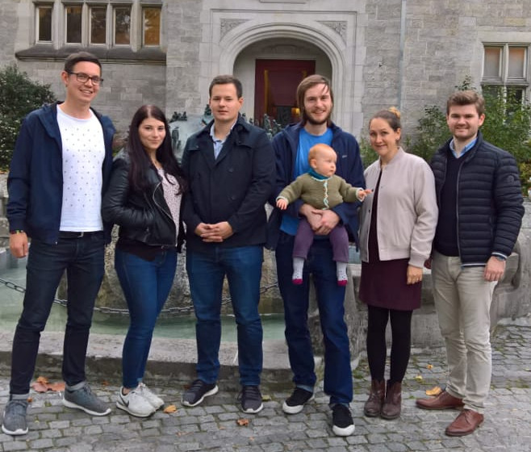

####Liebe Freunde und Mitglieder,   

nach der Jahreshauptversammlung im [St.-Michaels-Heim](https://www.st-michaels-heim.de/) in Berlin-Grunewald am 14. Oktober 2017 schauen wir auf ein produktives Treffen zurück.  
Zu Gast war Evelyn Marx, die zuletzt für ca. zwei Jahre im Kinderheim gearbeitet hat. Sie betreute u.a. die Kooperation mit den verschiedenen Schulen, die die Kinder besuchen und hatte so einen interessanten Einblick in Organisation und aktuelle Abläufe auf GGA. Sie konnte daher einiges berichten. Insbesondere in Bezug auf die weitere Förderung von Samkelwas Schulbesuch konnten so wichtige Informationen ausgetauscht werden.  
Vorstandswahlen stehen erst nächstes Jahr wieder auf dem Programm.

Vielen Dank an alle, die bei der Jahreshauptversammlung anwesend waren und zum Gelingen beigetragen haben.  

Liebe Grüße,  

Für den Vorstand  

_Moritz Putzar-Sattler_