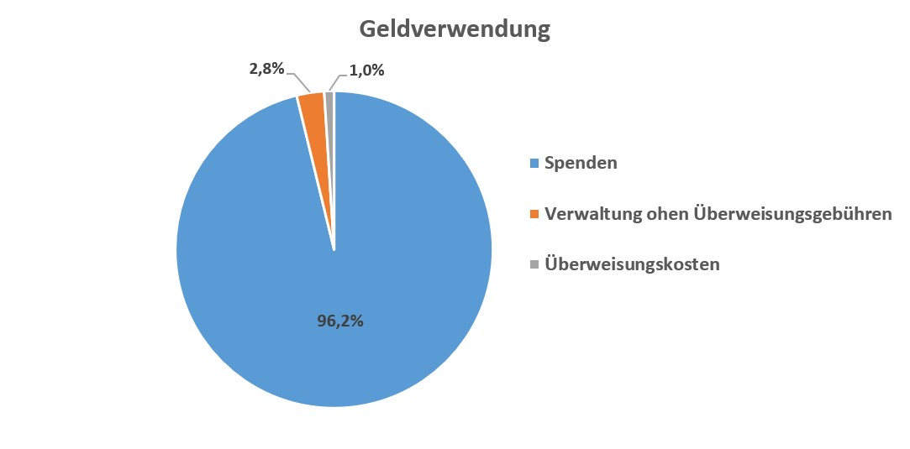

Der Verein "Freunde von God‘s Golden Acre Deutschland e. V." ist ein gemeinnütziger Verein, der insbesondere das Kinderheim "[God's Golden Acre](http://www.godsgoldenacre.org "God's Golden Acre")" in Südafrika (Cato Ridge) unterstützt, um dort jungen Menschen die Chance auf Bildung und ein Leben in Würde zu geben.  
Dazu sind wir stets auf Spenden angewiesen, die auch in Deutschland steuerlich begünstigt sind.

## Geldverwendung
Unser Verein hat sich als Ziel gesteckt direkte finanzielle Hilfe zu geben und deshalb kommen ca. 96% des Geldes beim Partnerprojekt an!   
Darauf sind wir stolz und müssen uns nicht hinter anderen gemeinnützigen Organisationen verstecken.

## Kontoverbindung  
VR-Bank Altenburger Land  
IBAN: DE89 8306 5408 0004 7819 02  
BIC: GENODEF1SLR 