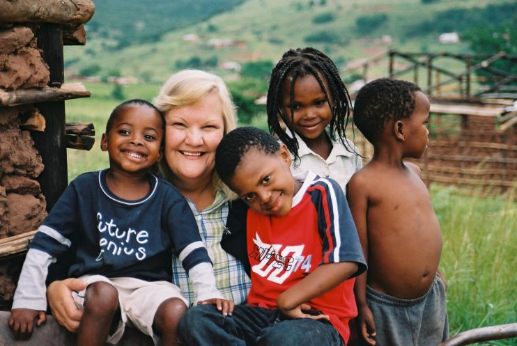

Der Verein "Freunde von God‘s Golden Acre Deutschland e. V." ist ein gemeinnütziger Verein, der insbesondere das Hilfsprojekt "[God's Golden Acre](http://www.godsgoldenacre.org "God's Golden Acre")" in Südafrika (Cato Ridge) unterstützt, um dort jungen Menschen die Chance auf Bildung und ein Leben in Würde zu geben.  
Der Verein wurde von Freiwilligen gegründet, die selbst in dem Hilfsprojekt für längere Zeit gearbeitet haben und darüber hinaus ehrenamtlich das Kinderheim fördern wollen.

### Give a Child a Home
  
"God's Golden Acre (GGA)" ist eine Organisation in Südafrika, die Kinder in einem Kinderdorf beherbergt und über andere Projekte unterstützt. Missbrauch, Vergewaltigung oder der Verlust der Eltern durch Gewalt und AIDS sind die häufigsten Gründe, warum Kinder verschiedenster Altersgruppen nach GGA kommen. Die Region des "Valley of a 1000 hills" ist immer noch von der Zeit der Apartheid gezeichnet, hat sehr hohe Arbeitslosigkeit und leidet extrem unter der AIDS-Pandemie.  
Hier gründete Heather Reynolds 1994 das Projekt, das sich dafür einsetzt, den Menschen in der Region nachhaltig zu helfen. Unter dem Motto "Give a Child a Home" (Kindern ein Zuhause geben) bietet GGA für viele Kinder in den Valleys eine Grundversorgung an Nahrungsmitteln und fördert ihre Bildung. GGA versucht die Kinder durch Aufklärung vor Vergewaltigung, Kriminalität, Gewalt sowie AIDS zu schützen und unterstützt sie dabei, schreckliche Erlebnisse aus der Vergangenheit zu bewältigen.  
Weitere Infos auch auf [Facebook](https://www.facebook.com/FreundeVonGodsGoldenAcreDeutschland "Freunde von God's Golden Acre Deutschland e.V. Facebook Seite")

