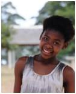

####Liebe Freunde und Unterstützer von God’s Golden Acre,   
wir hoffen, ihr seid alle wohlauf!   

Die Leiterin des Bereiches „Schule und Bildung“ bei GGA, Evelyn Marx, hat sich mit einem wichtigen Anliegen an uns gewandt: Für unsere Samkelwa wird dringend Unterstützung für die Finanzierung des weiteren Schulbesuches gesucht!

Samkelwa besucht aktuell noch die Primary School (Erweiterte Grundschule) in Camperdown bei Cato Ridge. Sie wird nach Ablauf des aktuellen Schuljahres im Dezember auf die High School wechseln. Im Moment setzt sich Evelyn mit großem Engagement dafür ein, eine möglichst gute Schule für Samkelwa zu finden, wofür zahlreiche Bewerbungsverfahren bereits durchlaufen wurden.   
Samkelwa konnte bei den diesbezüglichen Vorstellungsgesprächen mit exzellenten Lesefähigkeiten überzeugen und beeindrucken, so dass ihr ein Platz am sehr begehrten _Inanda Seminary_ in Durban angeboten wurde, ein hervorragendes Internat für junge Frauen. Dort wird ein qualitativ hochwertiges Bildungsangebot bereitgestellt, was jedes Jahr wieder durch entsprechend herausragende Matric(Abitur)-Ergebnisse der Absolventen bestätigt wird.   
Einigen wenigen Kindern von GGA konnten wir zuvor schon einen Besuch dieser Schule ermöglichen. GGA hat mit dem Inanda Seminary sehr gute Erfahrungen gemacht, mit dem Unterricht, besonderen außerschulischen Aktivitäten, jedoch auch mit dem Förderungssystem der Schule, das insbesondere den Schülern eine wichtige Unterstützung bietet, die mit sich mit dem Unterrichtsstoff schwerer tun.   
Mehr Informationen zum Inanda Seminary bietet die Website: [www.inanda.org](http://www.inanda.org "Inanda Seminary in Durban").   
Der Besuch dieses Internats ist eine einmalige Möglichkeit für Samkelwa. Leider ist gute Bildung in Südafrika mit hohen Schulgebühren verbunden. Aktuell fallen für ein Schuljahr pro Schüler 49.000 Rand (10 mal 4900 Rand im Monat) an, inklusive aller Kosten für die Unterbringung. Das entspricht aktuell einem Betrag von **ca. 3100 Euro pro Schuljahr**.   
Wenn wir es Samkelwa ermöglichen können, Inanda Seminary zu besuchen und damit eine gute Förderung und Bildung zu erhalten, würden wir Ihr essentielle Chancen für Ihre Zukunft verschaffen! Gerade die Bildung ist Grundlage und fast einzige Chance unseren Kindern in Zukunft ein Leben in Sicherheit und ohne Armut zu ermöglichen und sie zu verantwortungsbewussten und starken Bürgern eines Landes werden zu lassen, dass täglich um seine Zukunft zu ringen scheint.   
Uns ist klar, dass die Schulgebühren sehr hoch sind. Wenn wir die finanzielle Last auf mehrere Schultern verteilen könnten, wäre der Betrag leichter zusammenzubringen.   
Wenn Du zu etwas zur Unterstützung für Samkelwa beitragen möchtest oder weiterer Fragen hast, bitte zögere nicht uns zu kontaktieren! Evelyn ist unter [schools@godsgoldenacre.org](mailto:schools@godsgoldenacre.org "Leiterin des Bereiches „Schule und Bildung“ bei GGA") erreichbar, sie kann auf Deutsch oder auf Englisch mit euch kommunizieren.    

Bitte gebt unser Anliegen weiter, insbesondere an eure Freunde, Bekannte und Unterstützer!   

Vielen Dank im Voraus.
