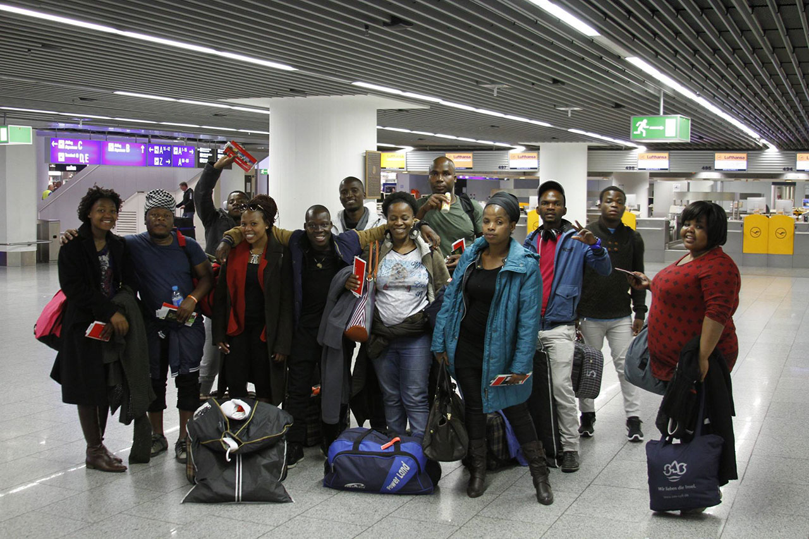

_Foto: Gert Odink_
So schnell können vier Wochen vergehen. Heute endet die Europatour der Young Zulu Warriors nach 18 Konzerten, mehreren Workshops in 3 Ländern und ca. 6000 zurückgelegten Kilometern. Der Chor und die Leiterin Heather Reynolds bedankt sich bei dem fantastischen Publikum, der großen Gastfreundschaft und den zahlreichen freiwilligen Helfern die die Konzerte und die Tour mit organisiert und dadurch erst ermöglicht haben!